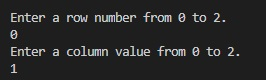
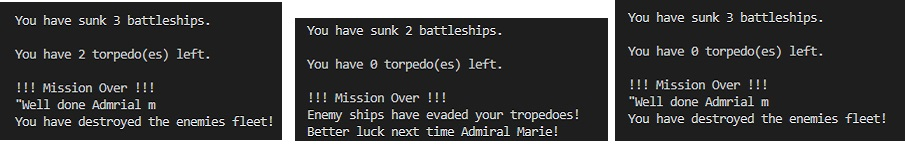
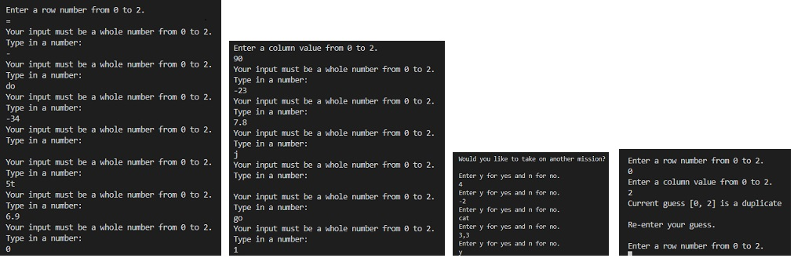

# **My Battleship**
This is a terminal game, written in Python, and runs on the Code Institute’s mock terminal on Heroku.

Users try to destroy a fleet of battleships generated by the computer before running out of torpedoes.  Players have 3 playing levels to choose from.  Each battleship occupies one “o” on the grid.

my game can be accessed from:
https://dawesies-my-battleship.herokuapp.com/ 

Pictures on desktop and mobile

# **How to play:**
The user is asked to select a mission level.  Once chosen, a playing grid, indicated by “o”, is generated with battleships randomly placed on the board.  
The user is asked for firing locations on the grid.  “X” represents a shot that has missed and “S” represents a shot that has sunk a battleship.  The game is won if all battleships have been hit before the number of allocated torpedoes has been depleted. 

# **Features**

## **Existing features**

**Rules of engagement**
Once the user has inputted their name, the rules and levels of the game are displayed.

The user is then asked to input the game level they want to play.

Once the level is inputted the playing board is generated.
The user will see the grid of “o”s and then be asked to input a row value.

Once row is entered the user will be asked for a column position.

Once column value entered, the grid is updated.  User’s progress is displayed, and user is then asked to launch another torpedo.

This cycle is repeated until either all the battleships have been destroyed or the user has run out of torpedoes.

 

User is then given the opportunity to play again or to stop playing. 

The battleships are randomly selected.

The number of ships hit, and torpedoes left is recorded.

Inputs are accepted and validated and entries are checked for duplicates.
Inputs must be numbers, y or n and a string for the name.

## **Features left to implement**

When there is time:

- I would like to add colour to the game.

- Allow the user to choose their own mission parameters.

- Allow the user to hover with the cursor over the location and fire the torpedo with the space bar.

- Have both coordinates be random, instead of controlling one as a way of ensuring no duplicates like I have done for this game.

# **Data Model**
I used a Missions class to establish the levels of play.

The Missions class stored all the information pertaining to the game, board size, guesses, number of torpedoes and how to evaluate the results.

The class made use of method like print, “create_board”, “position_ship”,” get_guess”, “validate_guess”, “duplicate_check” an update_board.  All of these methods were used aid in the playing of the game.

The function “play_game” was called, once the name had been entered, to give the rules and establish the level of play so that the Mission class could then set up the game.

# **Testing**

- I passed the code through the PEP8 linter tester and there were no issues.

- I gave invalid inputs like strings for numbers, numbers for strings, duplicate guesses , out of bound values to ensure the code would work under all conditions that I could think of to try.

- I tested the programme on my local terminal and the code institutes Heroku Terminal.

# **Bugs**
To my knowledge there are no unfixed bugs in the code, I resolved any problems as they arose, while I was developing the code.

# **Validator Testing**
PEP8
No errors were returned from https://pep8ci.herokuapp.com/

# **Deployment**

The project was deployed using the Code Institute’s mock terminal for Heroku.

Steps followed were:

- Fork or clone the repository.
- Create a new Heroku App.
- Set the buildingbacks to Python and NodeJS in that order.
- Link the Heroku App to repository.
- Click on Deploy.

#**Credits**

Websites that helped to inspired me to formulate ideas to develop the code for my own project.

Battleship Game Code in Python and Put Interactive Python Anywhere on the Web https://trinket.io/python/051179b6d3

Websites that helped me resolve issues with my code and syntax.

https://stackoverflow.com/

W3Schools Online Web Tutorials

Trevor a fellow coder who acted as my “rubber duck” and helped me by talking though code and logic problems.
